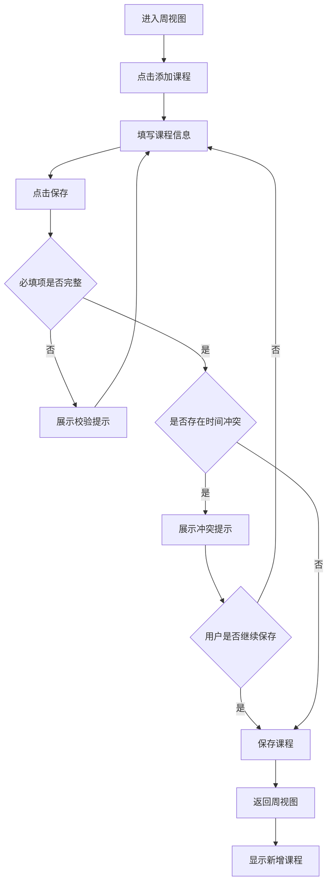
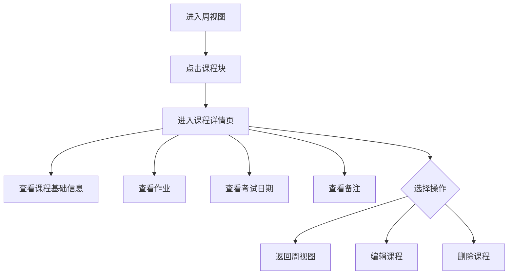
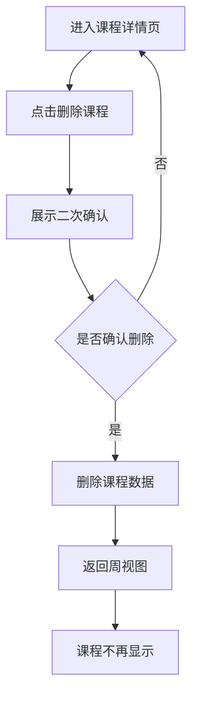
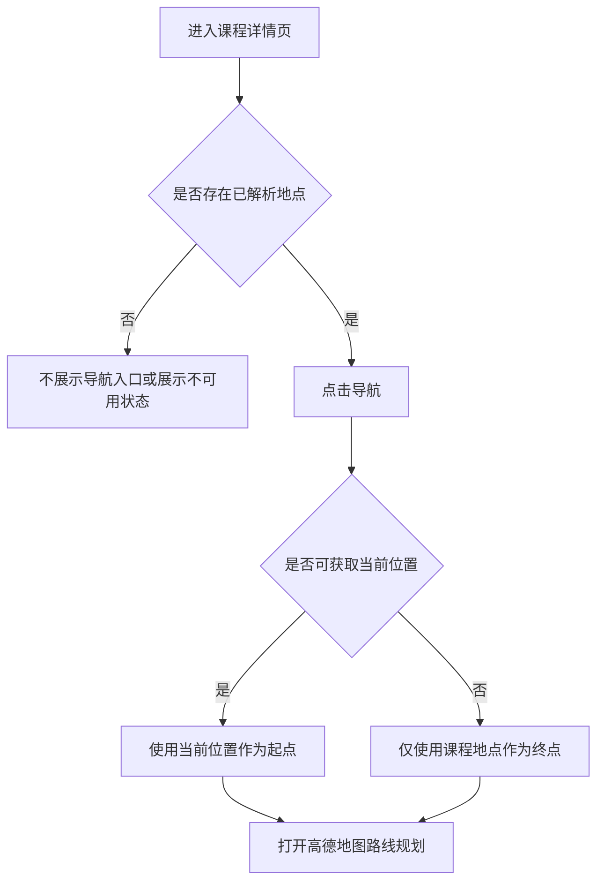

# 课表助手 PRD 文档

## 一、项目背景与目标

### 1.1 项目背景

学生在日常学习中需要频繁查看课程时间、教室、教师、作业、考试日期等信息。传统课表通常只展示上课时间和地点，无法集中管理课程相关事项，导致用户需要在多个地方记录和查找信息。

课表助手用于帮助用户完成课程录入、周课表查看、课程详情管理等基础学习管理动作。当前版本优先实现最小可用闭环：添加课程、查看课表、查看课程详情。

### 1.2 产品目标

- 让用户可以快速添加、编辑、删除课程。
- 让用户可以按周查看课程安排。
- 让不同课程通过颜色形成清晰区分。
- 让用户可以点击课程查看作业、考试日期、备注等详情。

### 1.3 当前版本范围

V1.0 聚焦以下核心功能：

- 课表管理：添加、编辑、删除课程。
- 周视图展示：按周展示课表，不同课程使用不同颜色。
- 课程详情页：点击课程查看课程信息、作业、考试日期、备注。

V1.0 暂不包含：

- 登录注册
- 云端同步
- 教务系统导入
- 课程提醒
- 多学期管理
- 课表分享

V1.1 计划增加：

- 上课地点导航：基于高德地图 API，为课程教室提供定位和一键导航能力。

## 二、用户角色

| 用户角色 | 角色说明 | 核心需求 |
| --- | --- | --- |
| 学生 | 主要使用者，需要管理个人课程安排 | 查看每周课程、记录作业和考试信息 |
| 教师 / 助教 | 后续扩展角色，V1.0 不支持 | 查看和维护课程时间、地点、备注 |

### 已确认事项

- V1.0 只面向学生。
- V1.0 不区分角色权限，教师 / 助教作为后续扩展角色。

## 三、用户故事

| 编号 | 用户故事 | 优先级 |
| --- | --- | --- |
| US-001 | 作为学生，我希望可以添加课程，以便把本学期课程录入系统。 | P0 |
| US-002 | 作为学生，我希望可以编辑课程，以便在教室、教师、节次变更时及时更新。 | P0 |
| US-003 | 作为学生，我希望可以删除课程，以便移除录入错误或已结束的课程。 | P0 |
| US-004 | 作为学生，我希望可以按周查看课表，以便快速知道本周每天有什么课。 | P0 |
| US-005 | 作为学生，我希望不同课程显示不同颜色，以便快速识别课程。 | P0 |
| US-006 | 作为学生，我希望点击课程后查看详情，以便查看作业、考试日期和备注。 | P0 |
| US-007 | 作为学生，我希望可以切换上一周和下一周，以便查看不同周次的课程安排。 | P1 |
| US-008 | 作为学生，我希望系统提示课程时间冲突，以便发现录入错误。 | P1 |
| US-009 | 作为学生，我希望可以从课程详情页一键导航到上课地点，以便减少找教室和赶课成本。 | P1 |

## 四、功能列表

### 4.1 课程管理

#### 4.1.1 添加课程

用户可以创建一门新课程。

课程字段：

| 字段 | 是否必填 | 说明 |
| --- | --- | --- |
| 课程名 | 是 | 例如：高等数学、大学英语 |
| 教师 | 否 | 任课教师姓名 |
| 教室 | 否 | 上课地点 |
| 地点经纬度 | 否 | 高德地图地点解析后的坐标，用于导航 |
| 地点名称 | 否 | 高德地图匹配到的标准地点名称 |
| 星期 | 是 | 周一至周日 |
| 节次 | 是 | 例如：第 1-2 节 |
| 周次 | 是 | 例如：第 1-16 周 |
| 颜色 | 否 | 系统自动分配，后续可支持手动选择 |
| 作业 | 否 | 课程作业说明 |
| 考试日期 | 否 | 课程考试日期 |
| 备注 | 否 | 其他补充信息 |

规则：

- 保存时校验必填字段。
- 新增课程成功后，返回周视图。
- 新课程显示在对应星期、节次和周次中。
- 系统自动为课程分配颜色。
- 课程颜色 V1.0 不支持用户自定义。
- 教室字段填写后，系统可尝试通过高德地图 API 解析地点。
- 地点解析失败不影响课程保存，但需要保留用户输入的教室文本。

#### 4.1.2 编辑课程

用户可以编辑已添加课程的全部字段。

规则：

- 编辑保存后，周视图和详情页同步更新。
- 如果修改星期、节次、周次，需要重新计算课程显示位置。
- 编辑失败时保留用户已填写内容。

#### 4.1.3 删除课程

用户可以删除已添加课程。

规则：

- 删除前展示二次确认。
- 确认删除后，课程从周视图移除。
- 删除后不可再进入该课程详情页。

### 4.2 周视图展示

周视图是产品首页，用于展示一周内的课程安排。

展示规则：

- 横向展示周一至周日。
- 纵向展示节次。
- 课程块展示课程名、教室、教师。
- 不同课程使用不同颜色。
- 同一课程在不同周次保持相同颜色。
- 当前周未上课的课程不显示。

交互规则：

- 默认进入当前周。
- 支持切换上一周、下一周。
- 点击课程块进入课程详情页。
- 无课程时展示空状态。
- 课程冲突时展示冲突提示。

### 4.3 课程详情页

课程详情页用于展示单门课程的完整信息。

展示内容：

- 课程名
- 教师
- 教室
- 地点导航入口
- 星期
- 节次
- 周次
- 作业
- 考试日期
- 备注

操作：

- 返回周视图
- 编辑课程
- 删除课程
- 导航到上课地点

空状态：

- 作业未填写时显示“暂无作业”。
- 考试日期未填写时显示“暂无考试日期”。
- 备注未填写时显示“暂无备注”。
- 教室未填写或地点无法解析时，不展示导航入口或展示不可用状态。

### 4.4 上课地点导航

上课地点导航用于帮助用户从课程详情页快速前往上课地点。

功能范围：

- 在添加或编辑课程时，用户填写教室后，系统可调用高德地图 API 进行地点解析。
- 在课程详情页展示“导航”入口。
- 点击“导航”后，系统基于课程地点打开高德地图导航或路线规划页面。
- 如设备支持定位，导航起点优先使用用户当前位置；如不支持，则只打开目标地点。

展示规则：

- 地点解析成功时，课程详情页展示标准地点名称和导航入口。
- 地点解析失败时，保留原始教室文本，并提示用户可以编辑为更明确的地点。
- 教室为空时，不展示导航入口。

交互规则：

- 用户点击“导航”后，跳转到高德地图进行路线规划。
- 若未获得定位权限，系统不强制授权，只使用目标地点打开地图。
- 若同一教室名称匹配到多个地点，添加 / 编辑课程时需要让用户选择一个地点，或保留原始输入不绑定坐标。

数据字段：

| 字段 | 是否必填 | 说明 |
| --- | --- | --- |
| 教室 | 否 | 用户输入的上课地点文本 |
| 地点名称 | 否 | 高德地图返回的标准地点名称 |
| 地点地址 | 否 | 高德地图返回的地址描述 |
| 地点经度 | 否 | 高德地图返回的经度 |
| 地点纬度 | 否 | 高德地图返回的纬度 |

暂不包含：

- 校园室内导航
- 实时位置共享
- 路线偏好设置
- 自动迟到风险提醒
- 教学楼地图维护后台

### 4.5 数据校验

| 校验项 | 校验规则 |
| --- | --- |
| 课程名 | 必填，建议不超过 30 个中文字符 |
| 星期 | 必选，范围为周一至周日 |
| 节次 | 必选，需要符合系统节次范围 |
| 周次 | 必填，需要为有效周次 |
| 教师 | 可选，建议不超过 20 个中文字符 |
| 教室 | 可选，建议不超过 30 个字符 |
| 地点名称 | 可选，需要来自高德地图解析结果或为空 |
| 地点经纬度 | 可选，需要为有效经纬度 |
| 考试日期 | 可选，需要为有效日期 |
| 作业 | 可选，支持多行文本 |
| 备注 | 可选，支持多行文本 |

### 已确认规则

- V1.0 默认每天 12 节。
- V1.0 只支持连续周，例如第 1-16 周。
- V1.0 不支持单双周。
- 课程冲突允许保存，但需要给出明显冲突提示。
- 课程颜色由系统自动分配，不支持用户自定义。
- 上课地点导航进入 V1.1，接入高德地图 API，只做课程详情页一键导航。

## 五、业务流程图（可选）

### 5.1 添加课程流程



### 5.2 查看课程详情流程



### 5.3 删除课程流程



### 5.4 上课地点导航流程



## 六、UI 原型或者布局图

### 6.1 周视图页面

```text
┌──────────────────────────────────────────────┐
│  <  第 3 周  >                    + 添加课程 │
├────────┬──────┬──────┬──────┬──────┬──────┬──────┬──────┤
│ 节次   │ 周一 │ 周二 │ 周三 │ 周四 │ 周五 │ 周六 │ 周日 │
├────────┼──────┼──────┼──────┼──────┼──────┼──────┼──────┤
│ 1-2    │ 数学 │      │ 英语 │      │ 物理 │      │      │
│        │ A101 │      │ B203 │      │ C301 │      │      │
├────────┼──────┼──────┼──────┼──────┼──────┼──────┼──────┤
│ 3-4    │      │ 计算机│      │ 体育 │      │      │      │
│        │      │ D405 │      │ 操场 │      │      │      │
├────────┼──────┼──────┼──────┼──────┼──────┼──────┼──────┤
│ 5-6    │      │      │      │      │      │      │      │
└────────┴──────┴──────┴──────┴──────┴──────┴──────┴──────┘
```

说明：

- 课程块使用不同背景色区分。
- 点击课程块进入课程详情页。
- 顶部支持切换上一周、下一周。
- 右上角提供添加课程入口。

### 6.2 添加 / 编辑课程页面

```text
┌──────────────────────────────┐
│  添加课程                     │
├──────────────────────────────┤
│  课程名 *   [              ]  │
│  教师       [              ]  │
│  教室       [              ]  │
│  星期 *     [ 周一       v ]  │
│  节次 *     [ 第 1-2 节  v ]  │
│  周次 *     [ 第 1-16 周  ]  │
│  作业       [              ]  │
│             [              ]  │
│  考试日期   [ 选择日期     ]  │
│  备注       [              ]  │
│             [              ]  │
├──────────────────────────────┤
│  取消                  保存   │
└──────────────────────────────┘
```

### 6.3 课程详情页

```text
┌──────────────────────────────┐
│  < 返回              编辑 删除 │
├──────────────────────────────┤
│  高等数学                     │
│  教师：王老师                 │
│  教室：教学楼 A101             │
│  地点：第一教学楼              │
│  [导航]                       │
│  时间：周一 第 1-2 节          │
│  周次：第 1-16 周              │
├──────────────────────────────┤
│  作业                         │
│  完成第 3 章课后习题           │
├──────────────────────────────┤
│  考试日期                     │
│  2026-11-20                   │
├──────────────────────────────┤
│  备注                         │
│  需要带教材和练习册             │
└──────────────────────────────┘
```

## 七、验收标准

### 7.1 课程管理

- 用户可以添加课程。
- 添加课程时，课程名、星期、节次、周次为必填。
- 必填字段为空时不能保存，并展示错误提示。
- 用户可以编辑已存在课程的任意字段。
- 编辑保存后，周视图和课程详情页展示最新信息。
- 用户可以删除课程。
- 删除课程前必须二次确认。
- 删除成功后，该课程不再出现在周视图。

### 7.2 周视图

- 用户进入产品后默认看到当前周课表。
- 周视图按星期和节次展示课程。
- 不同课程使用不同颜色。
- 同一课程在不同周次保持相同颜色。
- 点击课程块可以进入对应课程详情页。
- 切换上一周、下一周后，课程显示结果正确。
- 当前周无课程时展示空状态。

### 7.3 课程详情页

- 详情页展示课程名、教师、教室、星期、节次、周次。
- 详情页展示作业、考试日期、备注。
- 未填写作业、考试日期、备注时展示空状态文案。
- 用户可以从详情页进入编辑课程页面。
- 用户可以从详情页删除课程。
- 用户可以从详情页返回周视图。

### 7.4 上课地点导航

- 教室字段填写后，系统可以尝试解析地点。
- 地点解析成功后，课程详情页展示导航入口。
- 用户点击导航入口后，可以打开高德地图并以课程地点作为目的地。
- 地点解析失败时，课程仍可保存，详情页保留原始教室文本。
- 教室为空时，不展示可点击的导航入口。

## 八、边界条件

| 场景 | 处理方式 |
| --- | --- |
| 课程名为空 | 禁止保存，提示“请输入课程名” |
| 星期未选择 | 禁止保存，提示“请选择星期” |
| 节次未选择 | 禁止保存，提示“请选择节次” |
| 周次为空或格式错误 | 禁止保存，提示“请输入有效周次” |
| 教师为空 | 允许保存，详情页显示“暂无教师信息” |
| 教室为空 | 允许保存，详情页显示“暂无教室信息” |
| 教室填写但地点解析失败 | 允许保存，保留原始教室文本，不提供导航或提示地点不明确 |
| 地点匹配到多个结果 | 允许用户选择匹配地点，未选择时只保存原始教室文本 |
| 用户拒绝定位权限 | 仍可打开目的地地图，不使用当前位置规划路线 |
| 高德地图 API 请求失败 | 不影响课程查看和编辑，提示“地点服务暂不可用” |
| 作业为空 | 允许保存，详情页显示“暂无作业” |
| 考试日期为空 | 允许保存，详情页显示“暂无考试日期” |
| 备注为空 | 允许保存，详情页显示“暂无备注” |
| 同一时间存在多门课 | 允许保存，但需要展示明显冲突提示 |
| 当前周无课程 | 周视图展示空状态 |
| 删除课程后返回详情页 | 详情页不可访问，返回周视图 |
| 课程只在部分周次上课 | 非上课周不展示该课程 |

## 九、非功能性需求

### 9.1 易用性

- 添加课程流程应简单直接。
- 周视图需要让用户快速识别课程位置。
- 课程颜色需要保证文字可读性。
- 空状态文案需要明确说明当前状态。

### 9.2 性能

- 周视图切换响应时间建议小于 300ms。
- 添加、编辑、删除课程后的页面更新应即时反馈。
- 在课程数量较多时，课表滚动和切换仍应保持流畅。

### 9.3 数据可靠性

- V1.0 课程数据保存在本地。
- 保存成功后课程数据不能丢失。
- 编辑失败时保留用户输入内容。
- 删除前必须二次确认。
- 删除成功后需要同步更新周视图。

### 9.4 兼容性

- 优先适配移动端。
- Web 版本需兼容主流现代浏览器。
- 桌面端展示需要支持更宽的周课表布局。
- 地图跳转需要兼容移动端浏览器和桌面端浏览器；不强制要求用户安装高德地图 App。

### 9.5 可扩展性

- 数据结构需要预留单双周、调课、停课能力。
- 课程详情字段需要支持后续扩展为作业列表、考试提醒。
- 周视图需要支持未来扩展到多学期或多课表。
- 地点数据结构需要预留后续扩展到迟到风险提醒、课间路线提示。

## 十、已确认事项

以下事项已由产品负责人确认：

| 编号 | 问题 | 确认结论 |
| --- | --- | --- |
| TBD-001 | V1.0 是否只面向学生？ | 只面向学生 |
| TBD-002 | 是否需要登录账号？ | 不做登录 |
| TBD-003 | 数据保存在哪里？ | 本地保存 |
| TBD-004 | 节次范围是否固定？ | 默认每天 12 节 |
| TBD-005 | 周次是否支持单双周？ | 只支持连续周 |
| TBD-006 | 课程冲突是否允许保存？ | 允许保存，但给出明显冲突提示 |
| TBD-007 | 颜色是否允许用户自定义？ | 自动分配 |
| TBD-008 | 作业是否需要拆成任务列表？ | 先作为文本字段 |
| TBD-009 | 考试日期是否需要提醒？ | 只记录日期 |
| TBD-010 | 是否需要导入学校教务系统课表？ | 不做导入 |
| TBD-011 | 上课地点导航是否进入 V1.1？ | 接入高德地图 API，只做课程详情页一键导航 |
